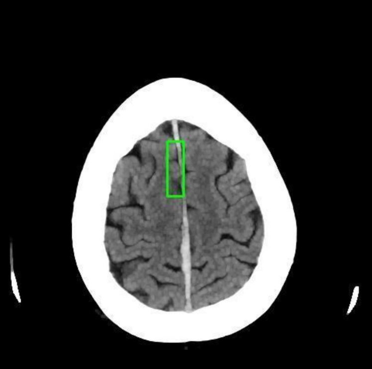
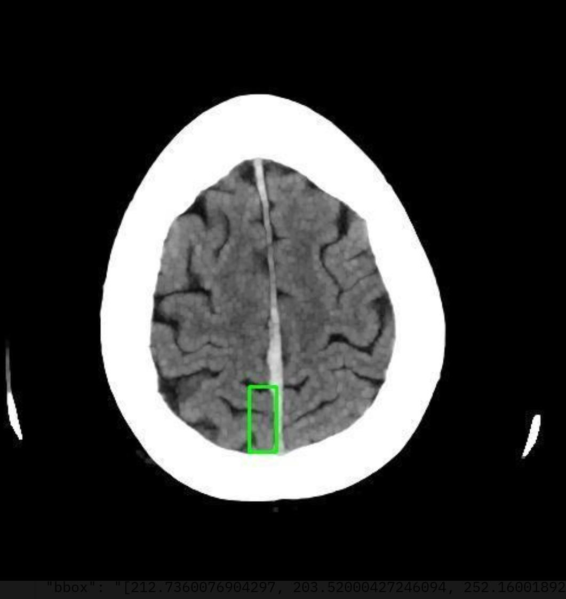
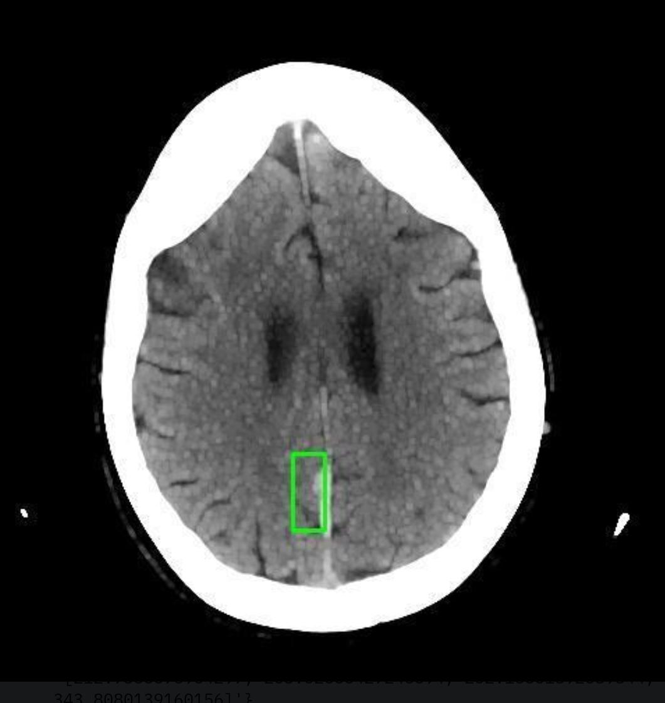

# Microsoft Florence-2 Vision Model for Brain CT Images

This project fine-tuned Microsoft's Florence-2 Vision Model for detecting region of interest in Brain CR Image and caption details.

## Overview

Florence-2 is a novel vision foundation model designed to handle a variety of computer vision and vision-language tasks with simple text prompts. This project allows you to upload an CT image and select a task to perform, such as region of interest detection, captioning, generate a JSON record and more.

## How to Run

1. **Install the required dependencies**:
   Ensure you have Python installed, then install the required packages using the following command:
   ```bash
   pip install -r requirements.txt
   ```

2. **Run the script**:
   Execute the Python script to start the Gradio interface:
   ```bash
   python app.py
   ```

3. **Use the Gradio Interface**:
   - Open the provided local URL in your web browser.
   - Upload an image using the "Upload Image" button.
   - Select a task from the "Select Task" dropdown menu.
   - Optionally, provide additional text input if required by the selected task.
   - Click the "Start" button to process the image and view the results.

## Available Tasks

- **Caption**
- **Detailed Caption**
- **Region of Interest** 
- **Detect Region Location**
- **Region Location Description**
- **Json Record**


## Example

1. Upload an image.
2. Select "Object Detection" from the task dropdown.
3. Click "Start" to see the detected objects highlighted in the image.

## Additional Information

For more details on Florence-2, you can refer to the official publication by Microsoft: [Florence-2: Advancing a Unified Representation for a Variety of Vision Tasks](https://www.microsoft.com/en-us/research/publication/florence-2-advancing-a-unified-representation-for-a-variety-of-vision-tasks/).

## Requirements

- gradio==4.36.1
- pillow==10.3.0
- transformers==4.41.2
- torch==2.3.1
- einops==0.8.0
- timm==1.0.7

Make sure to install these dependencies before running the script.

Enjoy exploring the capabilities of the Florence-2 Vision Model!

### Example of a detailed caption

### Example of a segmentation 'a cup of coffee'

### Example of detailed object detection

